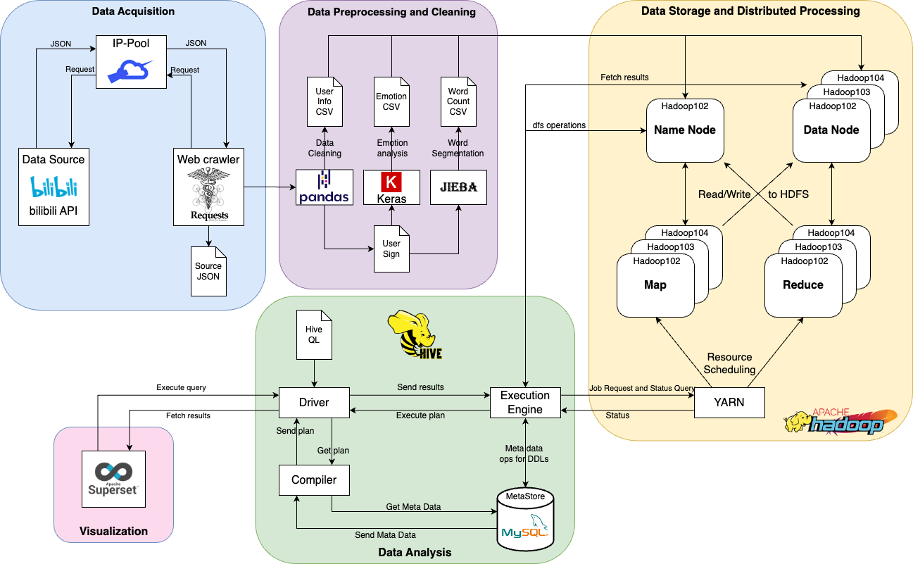

[toc]

# Analyze bilibili

##  Account and Password

Linux host：

```bash
Username: fox
Password: 123
```


Hive (on port 10000)：

```bash
Username: fox
Password: 123
```


##  Preparing the environment

All required environments and scripts are included in the OVA file. The version of the software used to:

| Software | Version |
| -------- | ------- |
| CentOS   | 7.5     |
| Hadoop   | 3.1.3   |
| Hive     | 3.1.2   |
| MySQL    | 5.1.34  |
| Superset | 2.1.2   |


## Architecture diagram



###  Description of the document

The required software installation directory is in `/opt/module`, which includes Hadoop, Hive, Superset, etc.


###  Configuring Hadoop

Changes can be made to the configuration file:

- HDFS

    ```bash
    /opt/module/hadoop-3.1.3/etc/hadoop/hdfs-site.xml
    ```

    

- MapReduce
    ```
    /opt/module/hadoop-3.1.3/etc/hadoop/mapred-site.xml
    ```

    

- Yarn
    ```
    /opt/module/hadoop-3.1.3/etc/hadoop/yarn-site.xml
    ```


### Configuring Hive

```
/opt/module/hive/conf/hive-site.xml
```


###  Configuring the Network

If you want the cluster to work properly and start properly with scripts, you can configure the network as you need it:

1. IP address of each cluster
    ```
    vim /etc/sysconfig/network-scripts/ifcfg-ens33
    ```

    

2. IP addresses and hostnames of other hosts in the cluster
    ```bash
    vim /etc/hosts
    ```

    

3. Modify the host name

    ```bash
    vim /etc/hostname
    ```


### Customized Environment Configuration

```bash
vim /etc/profile.d/my_env.sh
```


##  Startup scripts (except Superset)

The scripts are written to make it easy to start and shut down clusters or distribute files in a uniform manner. These scripts can also be modified for your environment and are located under `/bin`.

###  Start or shut down services on all hosts

```bash
myhadoop [start|stop]
```


###  Distribute files to all hosts

```bash
xsync FILES
```


###  View tasks running on all hosts

```bash
jpsall
```


###  Shut down all hosts

```bash
sudo shutdownall
```


## Data and data processing

In `/home/fox/bilibili/user_1000000.csv` contains a sample csv file with one million pieces of data (data has been cleaned).

The `word_cloud.csv` contains the data needed for the word cloud.

After starting Hive, you can execute `bilibili_hive_ql.sql` to import and analyze the data.


##  Launch Superset

Use the following command to start the visualization tool Superset on port 8099

```
conda activate superset
superset run -h YOUR_IP -p 8099 --with-threads --reload
```


###  Direct import of data

You can import the Dashboard's analysis results directly into Superset, the file provided is the folder `res_superset`.
